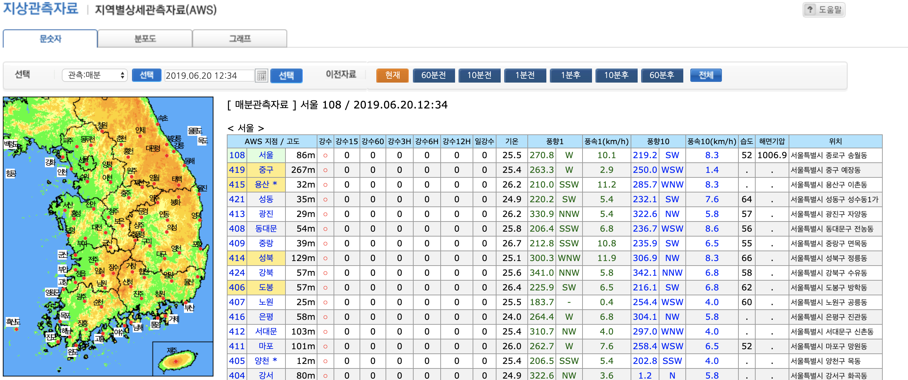
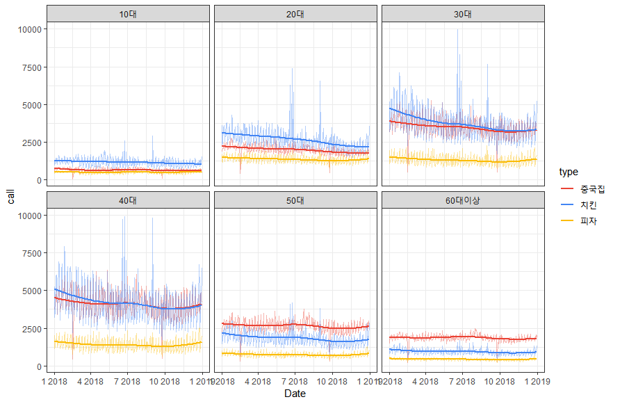

class: center, middle

background-image: url(Picture1.png)
background-position: center


.white[
#ITS EATS
###배달 빅데이터를 이용한 기업 서비스 제안]

---

background-image: url(Picture2.png)
background-position: center
background-size: contain

# 목차

<br><br>

- 프로젝트 소개 <br><br>
- 데이터 처리과정 <br><br>
- 모델링 <br><br>
- 서비스 제안 <br><br>
- 제언 <br><br>

---
class: center, middle

# 문제 정의
<br>

배달 주문량 데이터를 통해 배달 수요를 예측하여 새로운 배달 앱에 서비스 제안

.center[]

---
class: center, middle

background-image: url(Picture1.png)
background-position: center


.white[
#데이터 처리과정]
---
background-image: url(Picture2.png)
background-position: center
background-size: contain

### 데이터 전처리(1.날씨 변수)

.center[]

---
background-image: url(Picture2.png)
background-position: center
background-size: contain

### 데이터 전처리(2.한강)

.center[]

---
background-image: url(Picture2.png)
background-position: center
background-size: contain

### 데이터 전처리(3.공휴일)

```{r warning=FALSE, message=FALSE, echo=FALSE, include=FALSE}
its_eats <- read.csv("data_final.csv", na.strings = c("","-","NA"),row.names = 1,  fileEncoding = "euc-kr")
nrow(its_eats)
its_eats$month <- as.factor(its_eats$month)
its_eats$date <- as.factor(its_eats$date)
its_eats$rain <- as.factor(its_eats$rain)
its_eats$gangsu [is.na(its_eats$gangsu)] <- "NA"
its_eats$temperature[is.na(its_eats$temperature)] <- "NA"
its_eats$gangsu <- as.factor(its_eats$gangsu)
its_eats$temperature <- as.factor(its_eats$temperature)
library(tidyverse)

#10대, 20대 불러오기
teentwenty <- its_eats %>% 
  filter(age=="10대"| age=="20대")
#30대, 40대 합치기  
thirtyfourty <- its_eats %>% 
  filter(age=="30대"| age=="40대")
thirtyfourty_abbrev <- aggregate(call~date+day+gender+sido+region+
                                      dong+type+month+gangsu+rain+
                                      temperature,data=thirtyfourty,
                                      FUN=sum)
thirtyfourty_abbrev$age <- "30대40대"
#50대, 60대 합치기
fiftysixty <- its_eats %>% 
  filter(age=="50대" | age =="60대이상") 
fiftysixty_abbrev <- aggregate(call~date+day+gender+sido+region+
                                    dong+type+month+gangsu+rain+
                                    temperature,data=fiftysixty,
                                    FUN=sum)
fiftysixty_abbrev$age <- "50대이상"
its_eats <- bind_rows(teentwenty,thirtyfourty_abbrev,
                      fiftysixty_abbrev)
its_eats$age <- as.factor(its_eats$age)
levels(its_eats$age)
nrow(its_eats)
its_eats <- read.csv("final_0606.csv", header = TRUE,  fileEncoding = "euc-kr")
its_eats <- its_eats[,-1]
knitr::kable(head(its_eats),format = "html")
its_eats_1 <- its_eats
its_eats_1$day.x <- as.character(its_eats_1$day.x)
its_eats_1$day.x <- factor(its_eats_1$day.x,
                         levels=c("월","화","수","목","금","토","일"))

calls <- its_eats_1 %>% 
  group_by(type,date) %>% 
  dplyr::summarise(total=sum(call))
calls$date <- paste(str_sub(calls$date,start=1,end=4),
                    "-",
                    str_sub(calls$date,start=5,end=6),
                    "-",
                    str_sub(calls$date,start=7,end=8),
                    sep="")
calls$date <- as.Date(calls$date)
calls$month <- as.numeric(as.POSIXlt(calls$date)$mon+1)
              # 월 변수 추가
calls$monthf <- factor(calls$month,levels=as.character(1:12),
                       labels = c("Jan","Feb","Mar","Apr",
                                  "May","Jun","Jul","Aug",
                                  "Sep","Oct","Nov","Dec"),
                       ordered = TRUE) # 월 이름 추가
calls$weekday <- as.POSIXlt(calls$date)$wday
calls$weekdayf <- factor(calls$weekday, levels= c(0,6,5,4,3,2,1),
                         labels=rev(c("Mon","Tue","Wed","Thu",
                                      "Fri","Sat","Sun")),
                         ordered=TRUE)
calls$yearmonth <- zoo::as.yearmon(calls$date)
calls$yearmonthf <- factor(calls$yearmonth)
calls$week <- as.numeric(format(as.Date(calls$date),
                                "%W"))
library(plyr)
calls <- ddply(calls,.(yearmonthf),transform,
               monthweek=1+week-min(week))
p1 <- ggplot(calls,aes(monthweek,weekdayf,fill=total)) +
  geom_tile(colour="white") + facet_grid(type~monthf) +
  scale_fill_gradient(low="yellow",high="red")

```

```{r echo=FALSE}
p1
```
---
background-image: url(Picture2.png)
background-position: center
background-size: contain

### 데이터 전처리(4.스포츠)

.center[]

---

background-image: url(Picture2.png)
background-position: center
background-size: contain

#문제점
<br>
<br>

- 데이터 사이즈가 너무 크기에 R에서 실행되지 않았다. <br><br>
- 일부 컴퓨터의 경우에는 모델이 아예 실행 불가능하다. <br>

---
background-image: url(Picture2.png)
background-position: center
background-size: contain

#해결방향
<br>
<br>
--

- 데이터가 요약된 정보를 담고 있기에 표본추출 불가능


--

- 구별로 나눠서 분석할 경우 행정구 간에 상관관계를 파악할 수 없음


--

- 연령대 카테고리를 합쳐 데이터 줄이기 


--

- 동을 연속형 변수로 변경


--
---
background-image: url(Picture2.png)
background-position: center
background-size: contain

#해결방향

.center[]

--