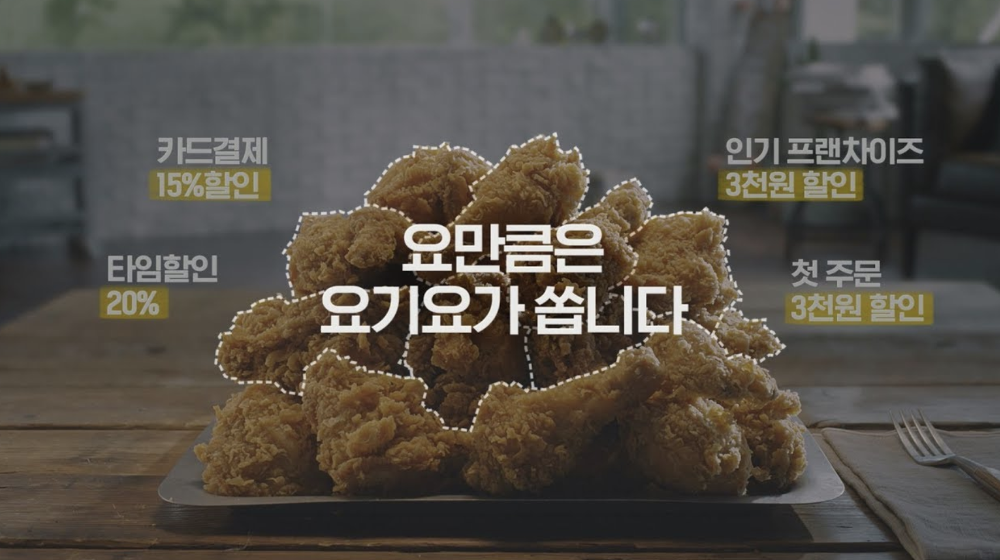
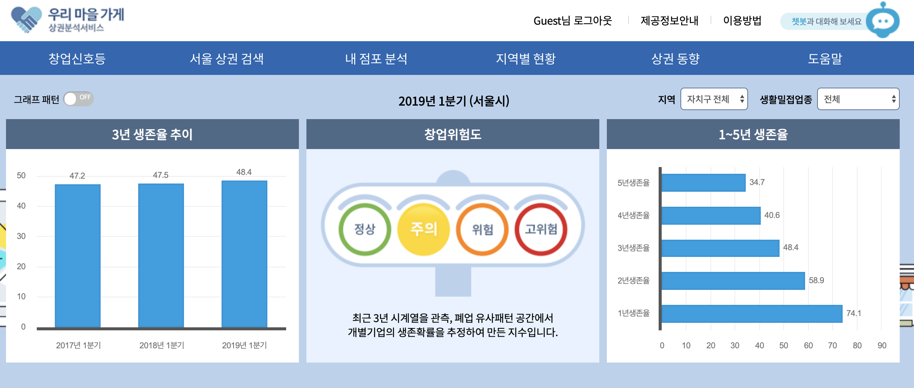
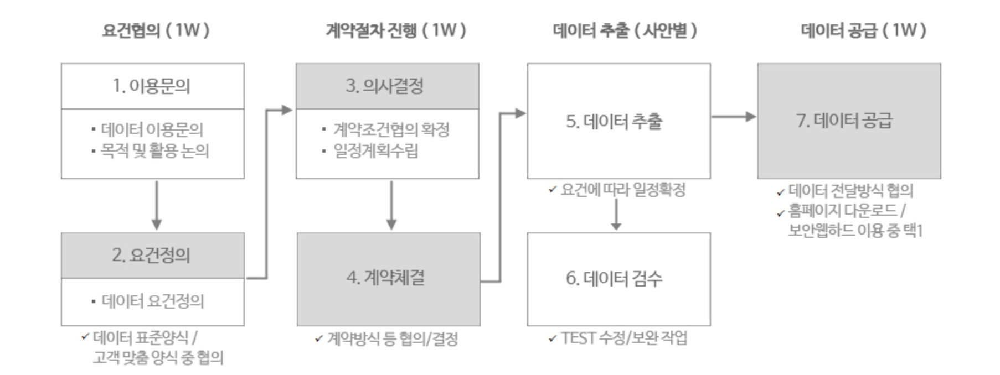
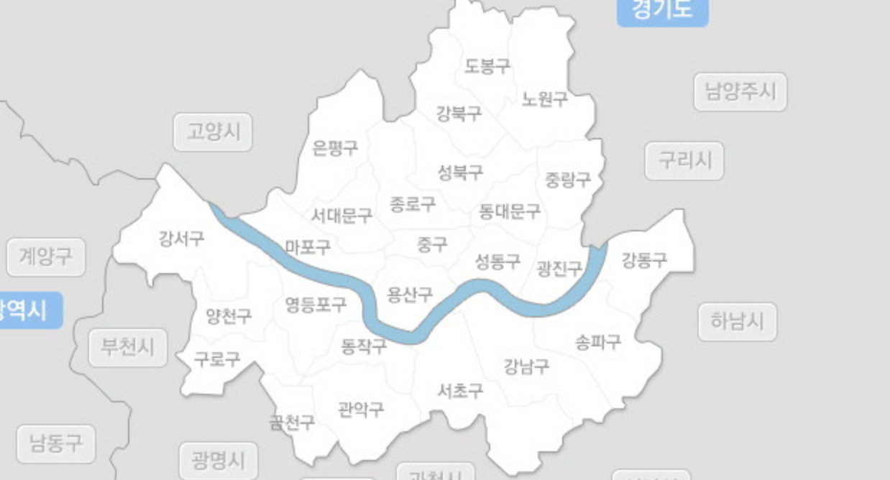

background-image: url(Picture2.png)
background-position: center
background-size: contain

### 3-1. XGboost (위도, 경도 적용)  
#### [ 중국집 배달 건수를 모델링 ]  
1. test, train set 나누기
```{r include=FALSE}
library(tidyverse)
```

```{r}
data <- read.csv("final_0618.csv",  fileEncoding = "euc-kr")
data_chinese <- data %>% filter(type=="중국집")
idx_chinese <- sample(1:nrow(data_chinese),nrow(data_chinese)*0.7)
train.df_chinese <- data_chinese[idx_chinese,]
test.df_chinese <- data_chinese[-idx_chinese,]
```

---
background-image: url(Picture2.png)
background-position: center
background-size: contain

### 3-1. XGboost (위도, 경도 적용)  
#### [ 중국집 배달 건수를 모델링 ]  
2. sparse matrix (원핫인코딩)
```{r include=FALSE}
library(Matrix)    
```

```{R}
sparse_matrix_train_chinese <- sparse.model.matrix(call ~ -1+day+gender+age+month+
                                                     longitude+latitude+gangsu+rain+
                                                     temperature+holiday+KBO+soccer,
                                                   data = train.df_chinese)
sparse_matrix_test_chinese  <- sparse.model.matrix(call ~ -1+day+gender+age+month+
                                                     longitude+latitude+gangsu+rain+
                                                     temperature+holiday+KBO+soccer,
                                                   data =  test.df_chinese)
output_vector_chinese = train.df_chinese[,"call"]
obs_chinese <- test.df_chinese[,"call"]
```


---
background-image: url(Picture2.png)
background-position: center
background-size: contain

### 3-1. XGboost (위도, 경도 적용)  
#### [ 중국집 배달 건수를 모델링 ]  
3. 모델링
```{r include=FALSE}
library(xgboost)
```

```{r}
set.seed(2013101041)
xgb_chinese <- xgboost(data = sparse_matrix_train_chinese,
                       label = output_vector_chinese,
                       max_depth = 6, eta = 0.3, nthread = 3, nrounds = 500,
                       objective = "count:poisson")

```

---
background-image: url(Picture2.png)
background-position: center
background-size: contain

# Variable Importance Plot
```{R}
importance_chinese <- xgb.importance(feature_names = colnames(sparse_matrix_train_chinese),
                                     model = xgb_chinese)
head(importance_chinese)
```

---
background-image: url(Picture2.png)
background-position: center
background-size: contain

```{R}
theme_set(theme_gray(base_family="PCMyungjo"))
xgb.plot.importance(importance_matrix = importance_chinese,
                    top_n=15)
```

---

### 3-1. XGboost (위도, 경도 적용)  
#### [ 치킨 배달 건수를 모델링 ]  
1. test, train set 나누기
```{r}
data_chicken <- data %>% filter(type=="치킨")
idx_chicken <- sample(1:nrow(data_chicken),nrow(data_chicken)*0.7)
train.df_chicken <- data_chicken[idx_chicken,]
test.df_chicken <- data_chicken[-idx_chicken,]
```

---
background-image: url(Picture2.png)
background-position: center
background-size: contain

### 3-1. XGboost (위도, 경도 적용)  
#### [ 치킨 배달 건수를 모델링 ]  
2. sparse matrix (원핫인코딩)
```{r}
sparse_matrix_train_chicken <- sparse.model.matrix(call ~ -1+day+gender+age+month+
                                                     longitude+latitude+gangsu+rain+
                                                     temperature+holiday+KBO+soccer,
                                                   data = train.df_chicken)
sparse_matrix_test_chicken  <- sparse.model.matrix(call ~ -1+day+gender+age+month+
                                                     longitude+latitude+gangsu+rain+
                                                     temperature+holiday+KBO+soccer,
                                                   data =  test.df_chicken)
output_vector_chicken = train.df_chicken[,"call"]
obs_chicken <- test.df_chicken[,"call"]
```


---
background-image: url(Picture2.png)
background-position: center
background-size: contain

### 3-1. XGboost (위도, 경도 적용)  
#### [ 치킨 배달 건수를 모델링 ]  
3. 모델링
```{r}
set.seed(2013101041)
xgb_chicken <- xgboost(data = sparse_matrix_train_chicken,
                       label = output_vector_chicken,
                       max_depth = 6, eta = 0.3, nthread = 3, nrounds = 500,
                       objective = "count:poisson")

```

---
background-image: url(Picture2.png)
background-position: center
background-size: contain

# Variable Importance Plot
```{R}
importance_chicken <- xgb.importance(feature_names = colnames(sparse_matrix_train_chicken),
                                     model = xgb_chicken)
head(importance_chicken)
```

---
background-image: url(Picture2.png)
background-position: center
background-size: contain

```{R}
xgb.plot.importance(importance_matrix = importance_chicken,
                    top_n=15)
```


---
background-image: url(Picture2.png)
background-position: center
background-size: contain

### 3-1. XGboost (위도, 경도 적용)  
#### [ 피자 배달 건수를 모델링 ]  
1. test, train set 나누기
```{r}
data_pizza <- data %>% filter(type=="피자")
idx_pizza <- sample(1:nrow(data_pizza),nrow(data_pizza)*0.7)
train.df_pizza <- data_pizza[idx_pizza,]
test.df_pizza <- data_pizza[-idx_pizza,]
```

---
background-image: url(Picture2.png)
background-position: center
background-size: contain

### 3-1. XGboost (위도, 경도 적용)  
#### [ 중국집 배달 건수를 모델링 ]  
2. sparse matrix (원핫인코딩)
```{r}
sparse_matrix_train_pizza <- sparse.model.matrix(call ~ -1+day+gender+age+month+
                                                     longitude+latitude+gangsu+rain+
                                                     temperature+holiday+KBO+soccer,
                                                   data = train.df_pizza)
sparse_matrix_test_pizza  <- sparse.model.matrix(call ~ -1+day+gender+age+month+
                                                     longitude+latitude+gangsu+rain+
                                                     temperature+holiday+KBO+soccer,
                                                   data =  test.df_pizza)
output_vector_pizza = train.df_pizza[,"call"]
obs_pizza <- test.df_pizza[,"call"]
```


---
background-image: url(Picture2.png)
background-position: center
background-size: contain

### 3-1. XGboost (위도, 경도 적용)  
#### [ 중국집 배달 건수를 모델링 ]  
3. 모델링
```{r}
xgb_pizza <- xgboost(data = sparse_matrix_train_pizza,
                       label = output_vector_pizza,
                       max_depth = 6, eta = 0.3, nthread = 3, nrounds = 500,
                       objective = "count:poisson")

```


---
background-image: url(Picture2.png)
background-position: center
background-size: contain

# Variable Importance Plot
```{R}
importance_pizza <- xgb.importance(feature_names = colnames(sparse_matrix_train_pizza),
                                     model = xgb_pizza)
head(importance_pizza)
```

---
background-image: url(Picture2.png)
background-position: center
background-size: contain

```{R}
xgb.plot.importance(importance_matrix = importance_pizza,
                    top_n=15)
```

---
class: center, middle

background-image: url(Picture1.png)
background-position: center


.white[
#서비스 제안]

---
class: center, middle


#예측 모델 이용한 서비스 제안
###xgboost을 이용하여 예측을 통한 수요 대비

---
background-image: url(Picture2.png)
background-position: center
background-size: contain

#서비스 1<br>
데이터를 이용하여 미래 예상 배달주문 건수 예측을 통한 수요 대비. 
```{r warning=FALSE, message=FALSE, echo=FALSE, include=FALSE}
person <- read.csv("person.csv",stringsAsFactors = F,  fileEncoding = "euc-kr")
person <- person %>% 
  select(-X,-day.y,-holiday_name) %>% 
  dplyr::rename(holiday = holiday.y, day = day.x, month = month.x)
person <- person %>% 
  mutate(day = factor(day, levels = levels(data$day)),
         gender = factor(gender,levels = levels(data$gender)),
         age = factor(age, levels = levels(data$age)),
         region = factor(region, levels=levels(data$region)),
         dong = factor(dong, levels=levels(data$dong)),
         type = factor(type, levels = levels(data$type))
  )
# dong 위도 경도 붙이기.
dong_lat_lon <- read.csv("dong_lat_lon.csv",  fileEncoding = "euc-kr")
person <- left_join(person,dong_lat_lon,by="dong")

# Soccer랑 KBO 붙이기.
data %>% 
  filter(date %in% person$date) %>% 
  group_by(KBO,soccer,date) %>% 
  summarise(n=n())

# 20181111: 둘다0, 20180823 & 20180901 : soccer만 1, 20180417 : KBO만 1
person <- person %>% 
  mutate(soccer = case_when(date==20181111 ~ 0, date==20180823 ~ 1,
                            date==20180901 ~ 1, TRUE ~ 0),
         KBO = case_when(date==20181111 ~ 0, date==20180823 ~ 0,
                         date==20180901 ~ 0, TRUE ~ 1))


person_chinese <- person %>% filter(type=="중국집")
person_chicken <- person %>% filter(type=="치킨")
person_pizza <- person %>% filter(type=="피자")


# person 데이터에 중국집 predict해보기.
person_sparse_matrix_chinese <- sparse.model.matrix(call ~ -1+day+gender+age+month+
                                                      longitude+latitude+gangsu+rain+
                                                      temperature+holiday+KBO+soccer,
                                                    data = person_chinese) 

person_pred_chinese <- predict(xgb_chinese, person_sparse_matrix_chinese)
cbind(pred = person_pred_chinese, obs = person_chinese$call)


# person 데이터에 치킨 predict해보기.
person_sparse_matrix_chicken <- sparse.model.matrix(call ~ -1+day+gender+age+month+
                                                      longitude+latitude+gangsu+rain+
                                                      temperature+holiday+KBO+soccer,
                                                    data = person_chicken) 

person_pred_chicken <- predict(xgb_chicken, person_sparse_matrix_chicken)
cbind(pred = person_pred_chicken, obs = person_chicken$call)

# person 데이터에 피자 predict해보기.
person_sparse_matrix_pizza <- sparse.model.matrix(call ~ -1+day+gender+age+month+
                                                    longitude+latitude+gangsu+rain+
                                                    temperature+holiday+KBO+soccer,
                                                  data = person_pizza) 

person_pred_pizza <- predict(xgb_pizza, person_sparse_matrix_pizza)
cbind(pred = person_pred_pizza, obs = person_pizza$call)
----------------------------------------------------------

#이렇게 해서 나온 값을 테이블로 띄우기

#설명: 고객 유형에 대한 피자, 치킨, 중국집 상대적인 선호도 파악하여 광고에 활용 (포털 사이트 연계 가능)
  
hongje <- read.csv("hongje_190316.csv",  fileEncoding = "euc-kr") 
hongje <- hongje %>% 
  mutate(day = factor(day, levels = levels(data$day)),
         gender = factor(gender,levels = levels(data$gender)),
         age = factor(age, levels = levels(data$age)),
         region = factor(region, levels=levels(data$region)),
         dong = factor(dong, levels=levels(data$dong)),
         type = factor(type, levels = levels(data$type)),
         month = 3
  ) %>% 
  left_join(dong_lat_lon,by="dong") %>% 
  mutate(KBO = 1,
         soccer = 1)

## sparse.model.matrix 들어가 있는 fac2[Ss]parse 패키지가 내 R에서 안 깔림. 
hongje_sparse_matrix_chicken <- sparse.model.matrix(call ~ -1+day+gender+age+month+
                                                      longitude+latitude+gangsu+rain+
                                                      temperature+holiday+KBO+soccer,
                                                    data = hongje) 

hongje_pred_chicken <- predict(xgb_chicken, hongje_sparse_matrix_chicken)
cbind(pred = hongje_pred_chicken, obs = hongje$call)

##### hapjeong 동

hapjeong <- read.csv("hapjeong_190316.csv",  fileEncoding = "euc-kr")
hapjeong <- hapjeong %>% 
  mutate(day = factor(day, levels = levels(data$day)),
         gender = factor(gender,levels = levels(data$gender)),
         age = factor(age, levels = levels(data$age)),
         region = factor(region, levels=levels(data$region)),
         dong = factor(dong, levels=levels(data$dong)),
         type = factor(type, levels = levels(data$type)),
         month = 3
  ) %>% 
  left_join(dong_lat_lon,by="dong") %>% 
  mutate(KBO = 1,
         soccer = 1)

hapjeong_sparse_matrix_chicken <- sparse.model.matrix(call ~ -1+day+gender+age+month+
                                                        longitude+latitude+gangsu+rain+
                                                        temperature+holiday+KBO+soccer,
                                                      data = hapjeong) 

hapjeong_pred_chicken <- predict(xgb_chicken, hapjeong_sparse_matrix_chicken)
cbind(pred = hapjeong_pred_chicken, obs = hapjeong$call)
##### daechi 동
daechi <- read.csv("daechi_190316.csv",  fileEncoding = "euc-kr")
daechi <- daechi %>% 
  mutate(day = factor(day, levels = levels(data$day)),
         gender = factor(gender,levels = levels(data$gender)),
         age = factor(age, levels = levels(data$age)),
         region = factor(region, levels=levels(data$region)),
         dong = factor(dong, levels=levels(data$dong)),
         type = factor(type, levels = levels(data$type)),
         month = 3
  ) %>% 
  left_join(dong_lat_lon,by="dong") %>% 
  mutate(KBO = 1,
         soccer = 1)

daechi_sparse_matrix_chicken <- sparse.model.matrix(call ~ -1+day+gender+age+month+
                                                      longitude+latitude+gangsu+rain+
                                                      temperature+holiday+KBO+soccer,
                                                    data = daechi) 

daechi_pred_chicken <- predict(xgb_chicken, daechi_sparse_matrix_chicken)
cbind(pred = daechi_pred_chicken, obs = daechi$call)


hongje_0<-hongje[,c(3:8)]
```

```{r}
knitr::kable(head(hongje_0),format = "html")
```
---
background-image: url(Picture2.png)
background-position: center
background-size: contain

#서비스 1
예측결과
```{r}

knitr::kable(head(hongje_1),format = "html")
```

---
background-image: url(Picture2.png)
background-position: center
background-size: contain

#서비스 1
실제 배달량
```{r}
knitr::kable(head(hongje_2),format = "html")
```
---
background-image: url(Picture2.png)
background-position: center
background-size: contain

#서비스 1의 장점 및 발전 방안

--

- 손쉽게 접할 수 있는 날씨 정보 & 고객의 기본적인 특성, 위치 정보 등을 이용하여 배달 수요를 손쉽게 예측 가능.<br>


--

- 주문량 수요를 예측하여 배달앱에 정보를 제공하면 날씨에 따른 소비 고객군의 변화 파악하여 효율적인 마케팅 전략 수립 가능. <br>


--

---
background-image: url(Picture2.png)
background-position: center
background-size: contain

#서비스 2: 고객 맞춤 팝업 광고

.center[]

---

class: center, middle

background-image: url(Picture1.png)
background-position: center


.white[
#제언]

---
background-image: url(Picture2.png)
background-position: center
background-size: contain

#개선 방향

1.파생 변수 생성 과정 <행정동 vs 법정도>

.center[]

---
background-image: url(Picture2.png)
background-position: center
background-size: contain

#개선 방향

2.비용의 한계

.center[]

---
background-image: url(Picture2.png)
background-position: center
background-size: contain

#개선 방향

3.위도 경도

.center[]

---


class: center, middle

background-image: url(Picture1.png)
background-position: center


.white[
#감사합니다]

---
